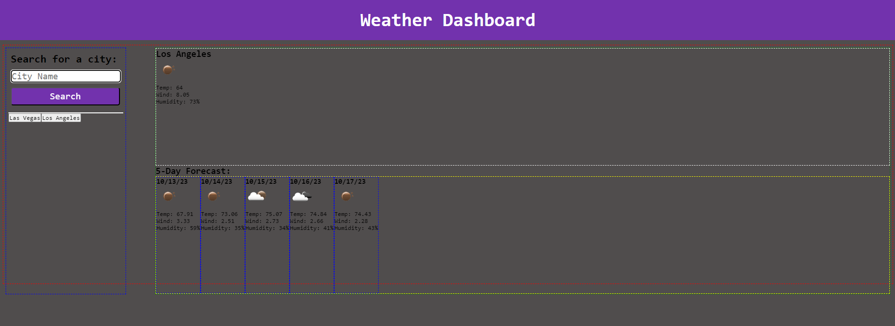

# Weather Application

## Description

The purpose of this project is to learn how to use fetch requests from an API to retrieve data that can be used dynamically in order to build a simple weather application. By using JavaScript, HTML, CSS, and the Weather One API, this application demonstrates an understanding of how to use a server API to fetch and render data on the page. The application features a search bar that allows users to type in the name of a city that they wish to view the weather in; if no city exists, the application will prompt users that their search was not a valid city. After clicking the "search" button, the weather will display dynamically on the right side of the screen, showing both the current forecast and the next 5 days' report. Upon displaying the weather results, users' previous searches will also be displayed as stored button, creating a history list for searches. Users may choose to click on the button of any past stored search if they wish to view the forecast again at any time. All user searches are stored in the local storage and must clear their local storage within the browser in order to wipe the search history. The motivation for this project was to practice using server-side APIs to create fetch requests via JavaScript and improve proficiency with creating dynamic applications. This project solves the issue of learning how to use server-side APIs as tools to create applications that render stored data.

## Installation

N/A

## Usage

To use the application, users will note that no current weather forecast is displayed upon opening the application. In the search bar, users can type a city name and hit the "search" button. Once the search button is clicked, it will trigger a function that renders the desired forecast on the page. Both the current forecast and the next 5 day forecast will appear on the screen. After searching for a city, the search will be displayed in a history list as a button that can be clicked to call back the forecast for that city. If a user searches for a city that does not exist, they will be alerted that the cty does not exist and cannot display a forecast. This search will not be stored in the history. 

## Credits

Weather One API for providing the data that renders the forecast of various global cities inside the application. Stack Overflow for community-based assistance in debugging some functions that were not working properly. Megan Meyers for assistance throughout building the project in various parts including a "throw/catch" method to properly catch any user searches that were non-existent, writing a function to create dynamic buttons based on user search history to redisplay past weather forecasts, and refactoring the code organization to troubleshoot any conflicting lines of code that caused functions to run in the improper order. 

## Link

https://chriswaje.github.io/weather-app/

## Image(s)

